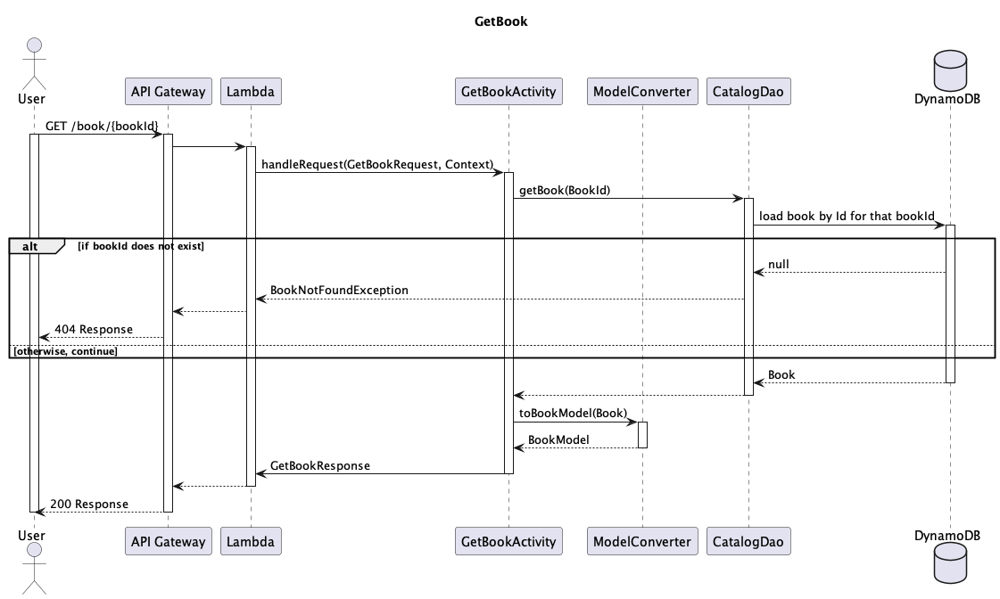
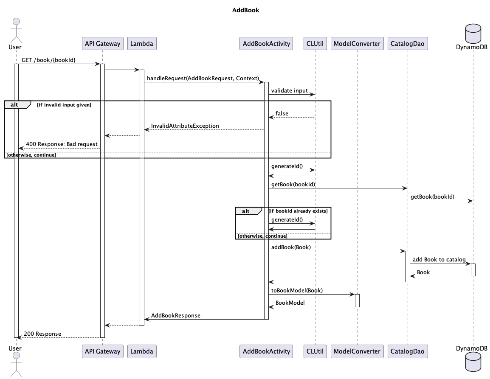

# Classroom Librarian

ClassroomLibrarian is an application to help teachers and students
keep track of their book collection across multiple classrooms
in a school building.

### Use Cases

* U1 As a student, I can view details for a specific book
* U2 As a student, I can browse to see what books are available in my classroom
* U3 As a student, I can browse to see what books are available in the school
* U4 As a student, I can check out a book for a specified amount of time
* U5 As a student, I can request a book from another classroom library
* U6 As a librarian, I can view which loans are overdue for my classroom
* U7 As a student, I can request a book be purchased for our library
* U8 As an Administrator, I can add books to our school catalog
* U9 As an Administrator, I can assign books a "home" library
* U10 As a librarian, I can update the condition of the book
* U11 As an Administrator, I can view which books are in need of replacement

### Project Phases

#### Currently in scope:
* U1 As a student, I can view details for a specific book
* U8 As an administrator, I can add books to our school catalog

#### Coming soon:
* U2 As a student, I can browse to see what books are available in my classroom
* U3 As a student, I can browse to see what books are available in the school
* U4 As a student, I can check out a book for a specified amount of time

### Considerations
* Implement caching

## Class Architecture 

[Class Architecture UML Diagram](diagrams/classroom-librarian-class-architecture.puml)

## Data models

Books
* `bookId` (String, partition key)
* `author` (String)
* `title` (String)
* `homeLibrary` (String)
* `status` (String - ENUM)
* `condition` (String - ENUM)
* `genre` (String - ENUM)

Users
* `studentId` (String, partition key)
* `homeRoom` (String)
* `password` (String)
* `email` (String)

Loans
* `studentId` (String - partition key)
*  `loanId` (String)
* `bookId` (String)
* `dueDate` (String - ZoneDate)

Requests
* `requestId` (String - partition key)
* `type` (String - enum)
* `bookId` (String)
* `homeLibrary` (String)

## API 

### GetBookActivity
* Accepts `GET` requests to `/books/:bookid`
* Accepts a bookId
* If an invalid bookId is provided, throws a
`BookNotFoundException`

### AddBookToCatalogActivity
* Accepts `POST` requests to `/books/`
* Accepts data to create a new book. Assigned a radom unique bookId.
* If name is not a valid string, throws an 'InvalidAttributeValueException'

### ViewAllBooksActivity
* Accepts `GET` requests to `\books`
* By default, returns books for current user's homeroom
sorted by availability
* Using optional query parameter "ALL", returns all books 
in school catalog, sorted by availability

